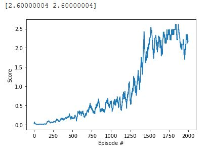

[//]: # (Image References)

[image1]: https://user-images.githubusercontent.com/10624937/42135623-e770e354-7d12-11e8-998d-29fc74429ca2.gif "Trained Agent"

# Project 3: Collaboration - Competition

![Trained Agent][image1]

# Implementation:
In order to solve the project the TD3 actor-critic method has been implemented.
The code which is splitted into model.py and DDPG_Agent.py is clearly documented for further information about the implementation itself

The neural networks have the following architecture:

The actor:
	- one input layer with the size 8 (representation of the state space)
	- three hidden layers with the size 400, 200 and 100 
	- one output layer with the size 2 (representation of the action space)
	
The critic:
	- one input layer with the size 8 (representation of the state space)
	- three hidden layers with the size 400+4to get the last action input of the actor in, 200 and 100 
	- one output layer with the size 2 (representation of the action space)
	
The agent creates one target neural network and one local neural network for both the actor and the critic

The agent has the following main functions:

	***def act(self, state, epsilon):***
		Functionality to determine the action in the current state.
        Additionally to the current action which is determined by the actor a normal distribution will be added to the
        action space to have enough exploration at least in the beginning of the training. The normal distribution will
        get smaller with time expressed through the parameter sigma
		
        :param state: Current state of the environment
        :param sigma: Parameter which decays over time to make the normal distribution smaller
        :return: action which shall be performed in the environment
	
	***def step(self, state, action, reward, next_state):***
		Get the current state, action, reward, next_state and done tuple and store it in the replay buffer.
        Also check if already enough samples have been collected in order to start a training step
		
        :param state: Current state of the environment 
        :param action: Action that has been chosen in current state
        :param reward: The reward that has been received in current state
        :param next_state: The next state that has been reached due to the current action
        :param done: Parameter to see if an episode has finished
        :return: -
			
	***def learn(self, experiences, gamma):***        
        Update policy and value parameters using given batch of experience tuples.
        Q_targets = r+ gamma * critic_target(next_state, actor_target(next_state)
            actor_target(state) --> action
            critic_target(state, action) --> Q-value
        Also update the the actor with gradient ascent by comparing the loss between the actor and the critiv actions.
        Perform the learning multiple times expressed by the parameter UPDATE_NUMBER
        
        IMPORTANT TRICK:
        A important trick has been introduced to make the learning more stable.
        The learning rate decays over time. After every learning step the learning rate will be decayed.
        This makes the agent in the beginning more aggressive and more passive the longer it trains
        The function for this is called exp_lr_scheduler
		
        :param experiences: A sample of states, actions, rewards, next_states, dones tuples to learn from
        :param gamma: Value to determine the reward discount
        :return: -
		
	***def exp_lr_scheduler(self, optimizer, decayed_lr):***  
		Set the learning rate to a decayed learning rate, without initializing the optimizer from scratch
		
        :param optimizer: the optimizer in which the learning rate shall be adjusted
        :param decayed_lr: the decaed learning rate to be set
        :return: optimizer with new learning rate
 
Additionaly a replay buffer class has been implemented in order to store state, acteion, reward, next state tuples in this buffer, in order to be able to learn from it
The replay buffer has two main functions:
	
	***add(self, state, action, reward, next_state):***
        Adding a nre state, action, reward, nect_state, done tuplt to the replay memory
		
        :param state: Current state
        :param action: Action taken in current state
        :param reward: Reward that has been granted
        :param next_state: Next state reached
        :param done: Information if environment has finished
        :return: -
		
	***def sample(self):***
        '''
        Radnomly sample a batch
		
        :return: A random selected batch of the memory
		
# Learning algorithm
As a learning algorithm a TD3 with a replay buffer, a local and a target network and a decaying learning rate has been choosen.

Local and target network:
This means there is a target network in order to calculate the TD target and a local DQN to calculate the actual Q-value.
The actor is used for interacting with the environment and the critic is used for learning.
Based on this the TD - error will be calculated in order to retreive the mean squared error loss which is the input to the backpropagation
to adjust the weights accordingly.
The target networks will be adapted slowly to not diverge to much from the local DQN

Replay buffer:
In order to brake the correlation between state, action and the resulting next state a replay buffer has been introduced. 
With the replay buffer, a random sample fo state, action, reward, next state batch will be retreived after a certain amount of time and the agent
will be trained on that random sample.

Decaying learning rate:
As the environment is quite sensible and the DDPG agent tends to leanr the right policy in the first place but gets very quickly very unstable 
and thus unlearn the policy quickly. This means you need to observe your agent very well in order to stop the learning process in the right time.
In order to make learning more stable a decaying learning rate has been introduced. The learning rate starts at a higher value to be more aggressive in the beginning
but it decays over time. This makes the learning not really slower as you still have a high learning rate in the beggining but more stable due to 
the lower learning rate at the end.
The environment was solved after about 1500 episodes

In order to train the agen the following hyperparameter has been chosen:

	- alpha_start critic = 2e-4 
	- alpha_min critic = 1e-6
	- alpha start actor = 2e-5
	- alpha_min actor = 1e-7
	- alpha_decay = 0.999
	- gamma = 0.99
	- tau = 0.001
	- sigma = 0.5 with sigma_decay=0.95 and sigma_min = 0.0001

Hyperparameters for replay buffer:

	- buffer size = 1e6
	- batch_size = 256
	- update_every = 15
	- update_number = 10

# Imporvement
An improvement to the implemented algorithm here could be to prioritize the memories inside the replay buffer.
The memories can be prioritized in different ways, e.g. if an extraordinary high or low reward has been granted, or if the state itself differs
a lot from the other states in the replay buffer

